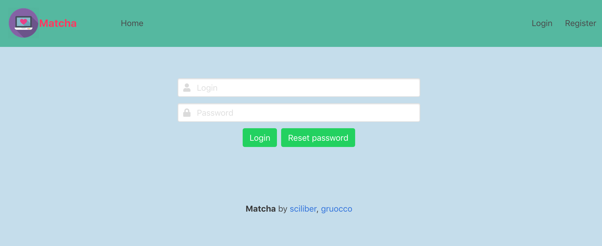

# Matcha 
###### Ecole 42 - Web Branch project n. 2

A collaborative project with the objective of creating a dating website.


## Getting Started

Follow these instructions to get a copy of the project and run it on your local machine for development and testing purposes.

### Prerequisites

```
node 10.16.0
npm
mysql 14.14

```

### Installing
```
git clone https://github.com/Seren4/matcha.git
 
cd matcha/server && npm run setup && npm start

cd ../client && npm run setup && npm start
```

## Features

### User Connection
- User registration with email address, username, last name, first name and password
- Login with username and password
- Forgotten password reset via email



### User Area
- Geolocation with GPS positioning or manual research
- Interests tag list editing
- Profile informations editing
- Photo gallery editing

    
- Password, username and email editing


### Home page
- List of suggested profiles, based on geographical area, common interests and popularity rating
- List sorting and filtering by age, location, rating and tags
- Additional sections: list of users who have liked or seen the profile of the current user


### Users profiles
- Each time a user goes on a profile, the visit is registered in the visited profile's history
- The user profile shows the relationship with the visitor (likes exchanged), the status (online or last connection date) and allows to open the chat, to change the like status, to ban the user or report it as fake


### Chat
- When both users like each other, they can chat in real time


### Notifications

The user receives a real time notification in the following cases:
- The user received a like
- The user’s profile has been checked
- The user received a message
- A "like" has been reciprocated
- The user has been "unliked" from an already "liked" user


### Mobile Version


## Built with

* [Express](https://expressjs.com/)
* [Vuejs](https://vuejs.org/)
* [MySQL](https://www.mysql.com/)
* [Bulma](https://bulma.io/)
* [Socket](https://socket.io/)


## Authors

* **Serena Ciliberti** - [Seren4](https://github.com/Seren4)
* **Giovanni Ruocco** - [J0oR](https://github.com/J0oR)
